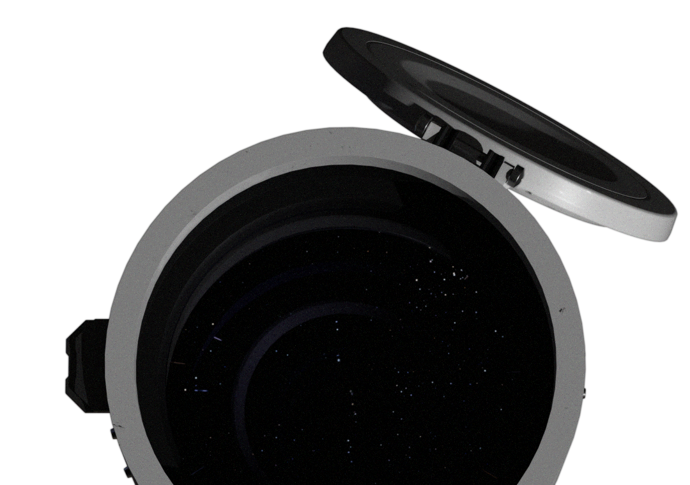
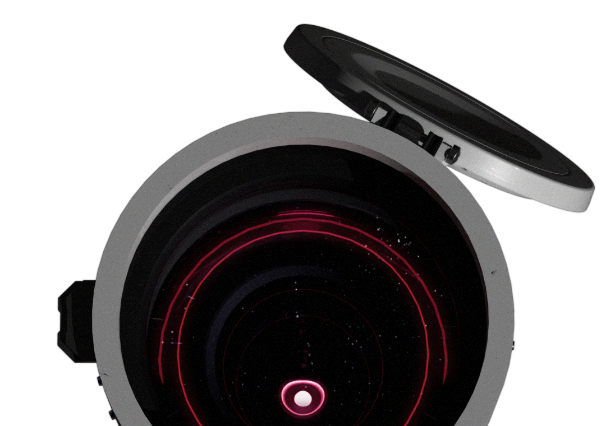
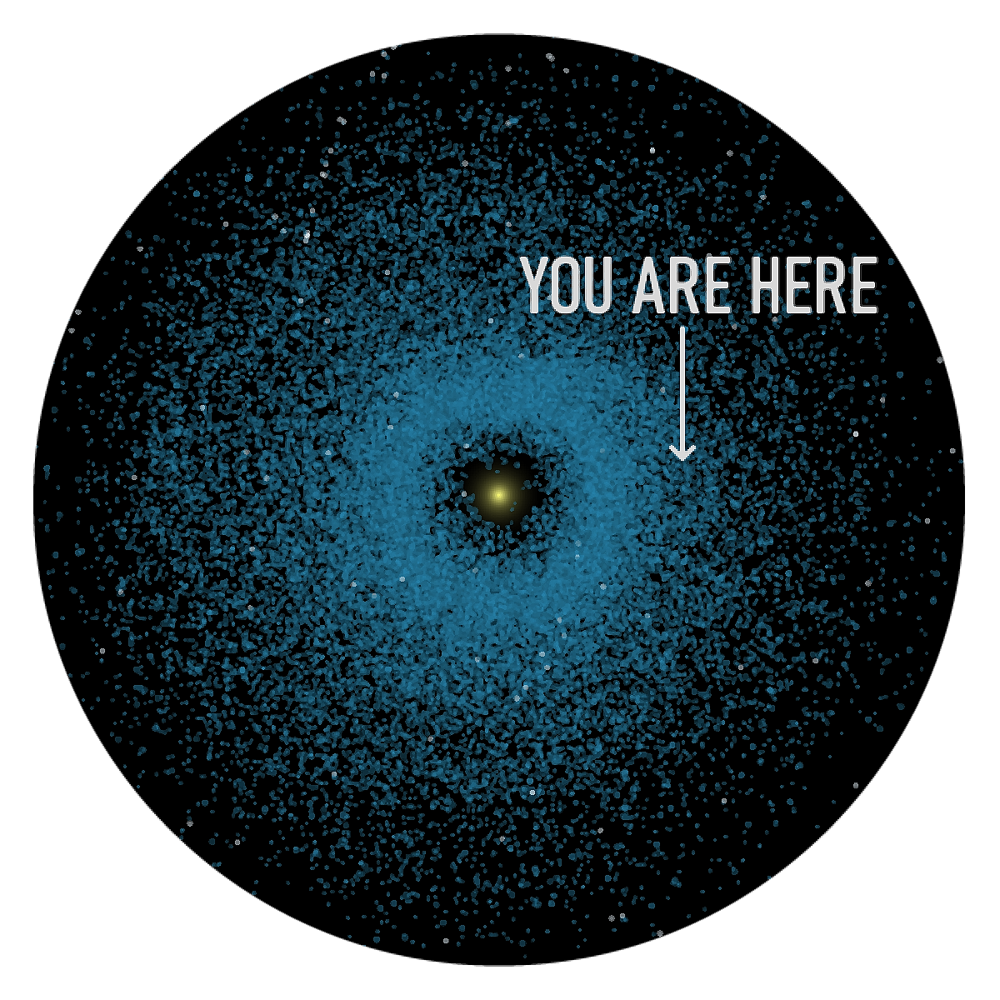
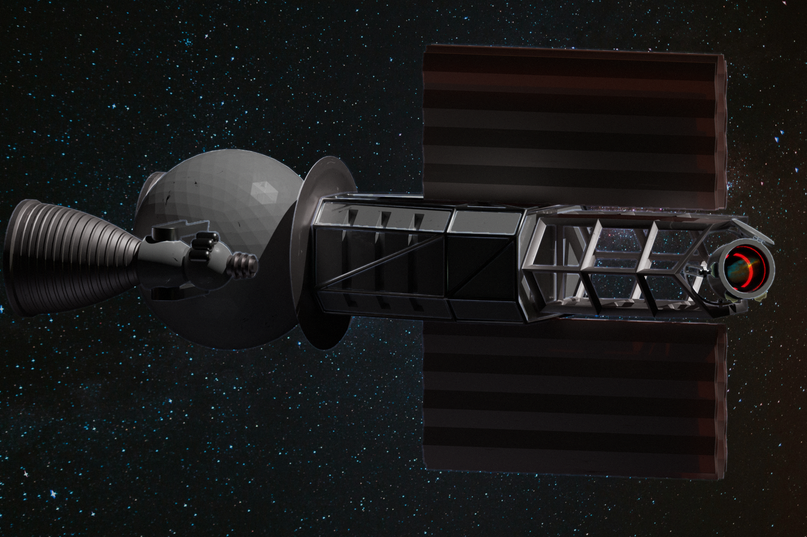

# Welcome to Skyrocket

## Want space rocks? Want them fast? Look no further!
Founded on innovation and ambition, Skyrocket&reg; began as a visionary startup that achieved the unimaginable: altering the trajectory of an asteroid in 2084, **safeguarding** our planet and **proving** that the limits of space are meant to be challenged.
Today, Skyrocket&reg; continues to push the boundaries of space technology, developing advanced spacecraft that redefine efficiency, safety, and capability. With cutting-edge propulsion, intelligent control systems, and modular versatility, our vehicles empower humanity to explore, transport, and harness the resources of the cosmos like never before.
At Skyrocket&reg;, we don't just reach for the stars—*we make them reachable*.

> There are a lot of Near-Earth asteroids orbiting around the Sun.

## Roadmap
- Foundation: 6/9/2084
- Pitch Deck Success: 12/11/2086
- Market Success: 4/20/2089
- The Present
- Space Station: 2092
- Pusher Ship Project: 2100

## Our Product

### Flux Overflow
The Flux Overflow class deep space unmanned mining-transportation space vehicle is the **most cost-efficient** ship on the market.
- Nuclear propulsion
- AI & manual control
- 20 km/s &Delta;v
- Push & tug engine modes
- Retractable radiators

## Our Offers
Now **only** $4200M per ship
`BUY (button)`

Or rent it for $1.5M/day*
`RENT (button)`

> *Potential post-rent repair costs not accounted.
