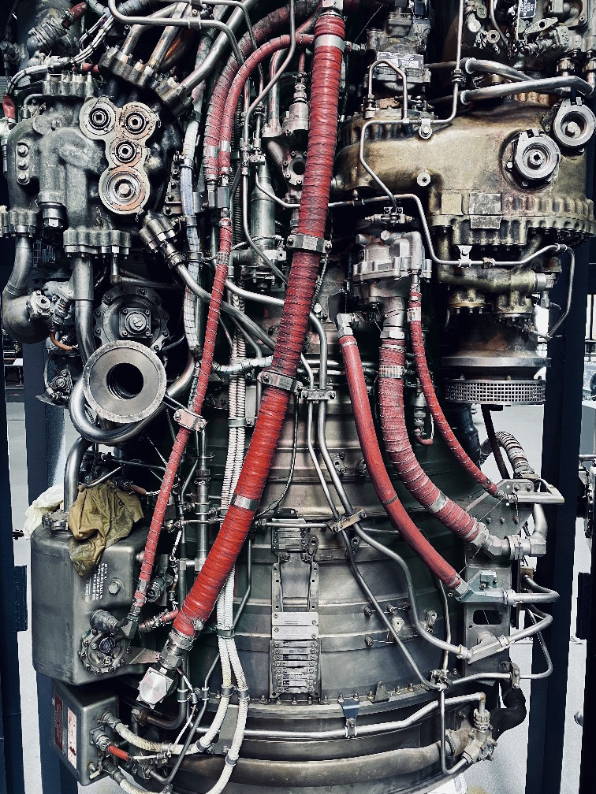
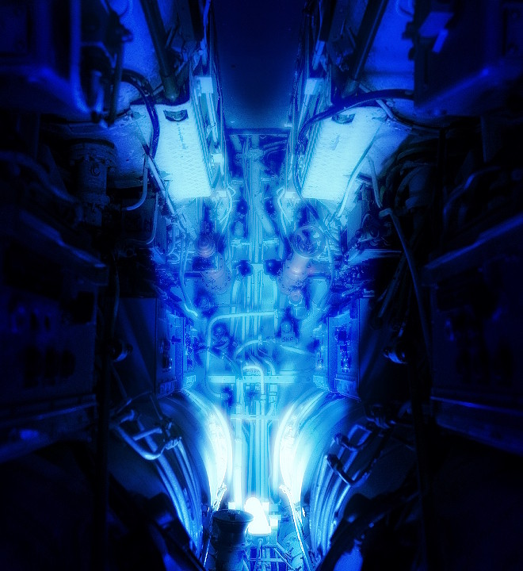
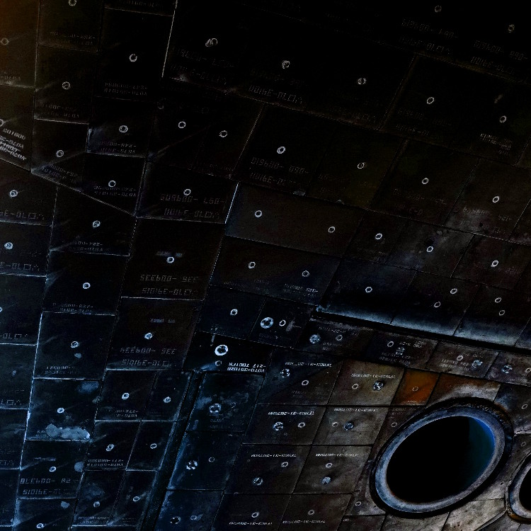
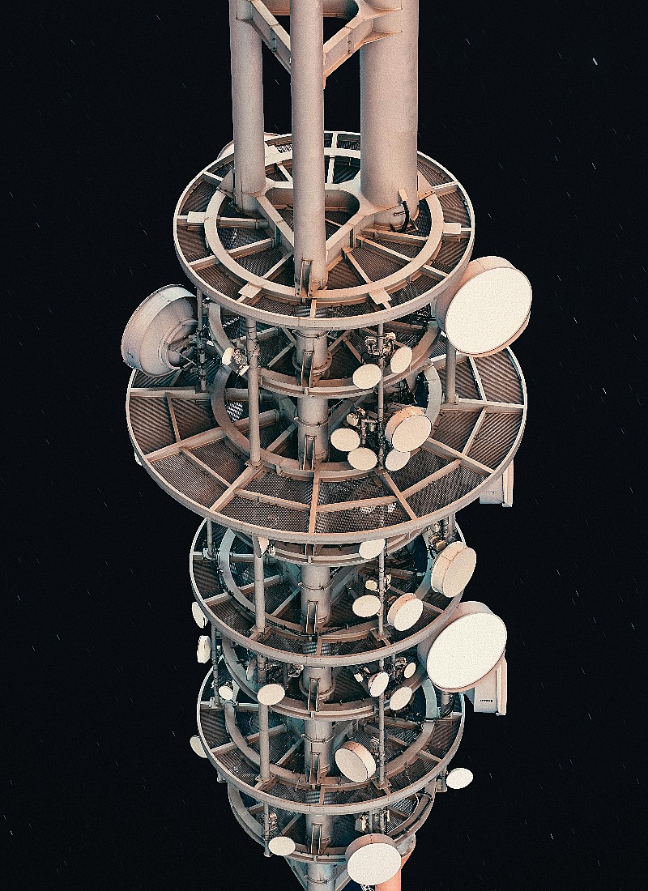

# The Ship - Flux Overflow

## Dual NTR Propulsion System

> The piping of the prototype above the engine nozzle.

The Flux Overflow is powered by two high-efficiency Nuclear Thermal Rocket (NTR) engines mounted on independent 180° gimbal rings. Each engine can rotate from forward thrust (acceleration) to reverse thrust (deceleration or push-mode operations) without reorienting the spacecraft.

|                  | 1 Engine  | Dual Engines |
| ---------------- | --------- | ------------ |
| Exhaust Velocity | 9,240 m/s | 9,240 m/s    |
| Specific Impulse | 925-960 s | 925-960 s    |
| Thrust           | 1.8 MN    | 3.6 MN       |
| Acceleration     | 0.18 g    | 0.36 g       |

Engine Specifications: The table contains information about the performance of both the engine and the dual engine.

The propellant is liquid hydrogen:

Hydrogen propellant is superheated in a high-temperature reactor core and expelled through composite carbon-carbon nozzles. The high exhaust velocity enables exceptional deep-space maneuverability while maintaining unmatched fuel economy.

The engines are rated for 18,000 operational hours and include autonomous restart capability after cold soak periods exceeding 5 years.

## Spherical Fission Reactor

> The Cherenkov radiation lighting up the coolant inside of the reactor.

At the bottom of the spacecraft lies a 14-meter diameter spherical reactor module. The geometry ensures uniform neutron flux distribution and maximum structural integrity under sustained output.

Properties:
- Thermal Power: 4.5 GW
- Electrical Output: 1.2 GW
- Engine Feed: Direct thermal coupling to engine cores
- Laser Allocation Capacity: Up to 800 MW continuous

The reactor supplies heat directly to the NTR engines during propulsion phases. During cruise or mining operations, power is diverted to the laser array and onboard systems.

Advanced radiation containment:

Triple-redundant magnetic control drums regulate reactivity. In the event of catastrophic fault detection, the reactor can enter a passively stable subcritical configuration in under 0.8 seconds.

The spherical exterior houses layered neutron reflectors and boron-carbide control assemblies, providing both efficiency and containment reliability for decades of continuous operation.

## Radiation Shielding

> The shield is composed of tiles.

Designed for deep-space nuclear operations, the shielding system protects both onboard electronics and any maintenance crew during rare crewed servicing missions.

Composition:
- Tungsten-boron carbide neutron absorber lattice
- 1.8 meters of cryogenic hydrogen tank shadow shielding
- High-density polyethylene proton attenuation layer
- Electromagnetic plasma deflection grid (active mode)

Radiation Attenuation:
- Reduces reactor-forward neutron flux by >99.97%
- Gamma attenuation factor: 1:4,500

The ship is primarily unmanned, but shielding ensures electronic systems experience radiation levels comparable to high Earth orbit satellites.

## Structural Truss & Systems Core

> The truss contains antennas and sensors, the only blindspot's behind the shield.

The primary structure is a long carbon-titanium composite truss extending between propulsion and payload interface. The open wireframe geometry minimizes mass while maximizing rigidity.

Cryogenic propellant and coolant tanks are mounted internally within the truss lattice for impact protection and thermal stability. At the structural midpoint lies a hardened supercomputer, a navigation and optimization array controlled by our in-house AI.

The physical separation between reactor, computation core, and engines minimizes vibrational and radiation interference.

## Retractable Radiator Array

> Molten lithium that flows inside the radiators.

Waste heat rejection in vacuum is mission-critical. The class uses four enormous folding radiator wings extending up to 180 meters when fully deployed.

The cooling system relies on a liquid lithium primary loop, paired with a secondary helium-xenon Brayton cycle, allowing a maximum heat rejection of 3.8 GW under full deployment, while a retracted emergency mode can handle up to 450 MW.

The radiators use graphene-reinforced carbon panels with micro-channeled flow paths to maximize surface area. During high-thrust burns, the radiators deploy partially to balance structural stress and thermal efficiency.

When retracted, armored composite shutters protect panels from debris during asteroid operations.

## High-Energy Industrial Laser Beam

> Lens of the laser beam up close.

The forward-mounted phased laser array is the ship's primary mining and asteroid manipulation tool.

Laser Specifications:
- Continuous Output: 800 MW
- Peak Pulse Output: 2.4 GW
- Effective Range (Ablation): 1,200 km
- Spot Precision: <5 cm at 500 km

Secondary Functions:
- Deep-space optical communication
- Long-range LIDAR mapping
- Debris fragmentation

The laser alters asteroid trajectories by controlled surface ablation. Melted material resolidifies into thrust-optimized geometry, allowing efficient push operations using minimal propellant.

The phased array can operate in precision low-power mode for communication across millions of kilometers with negligible beam divergence.
